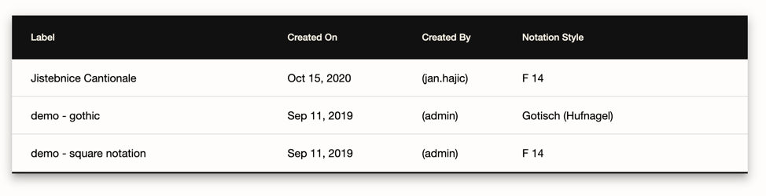
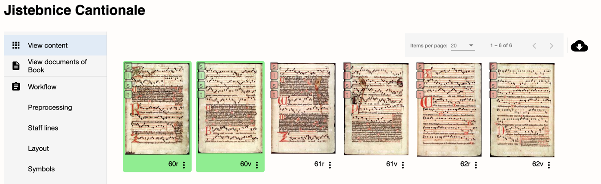
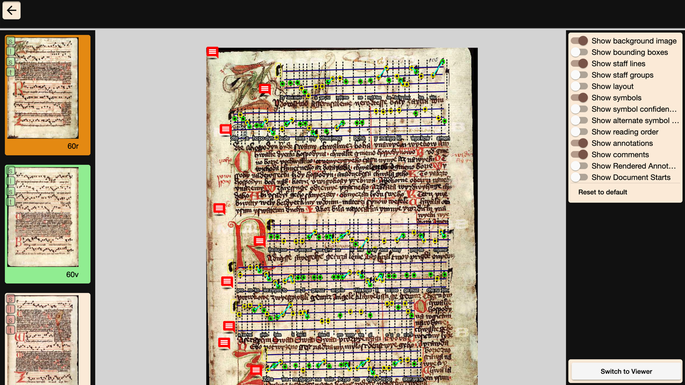
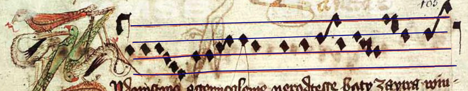
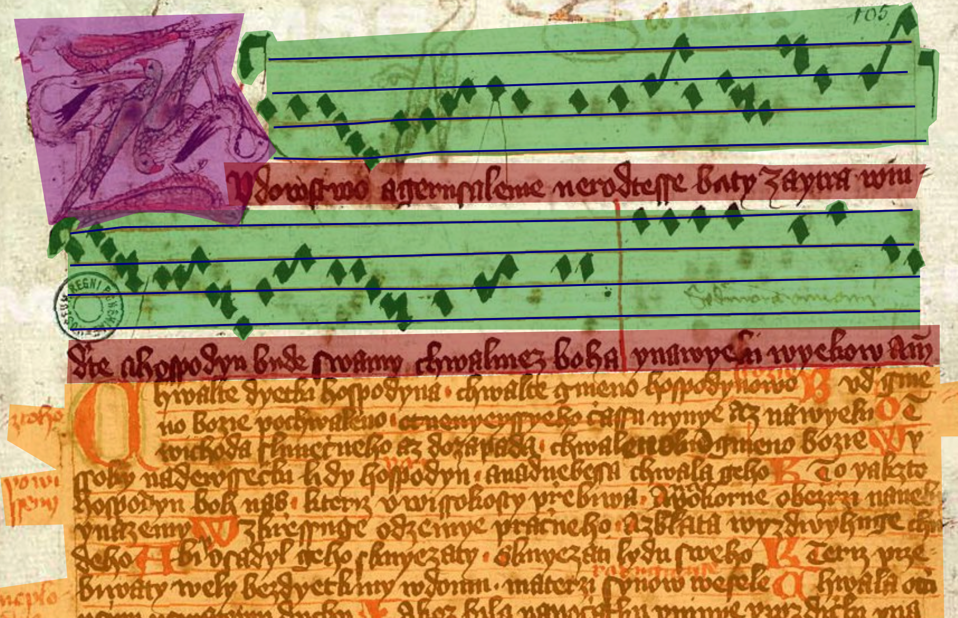
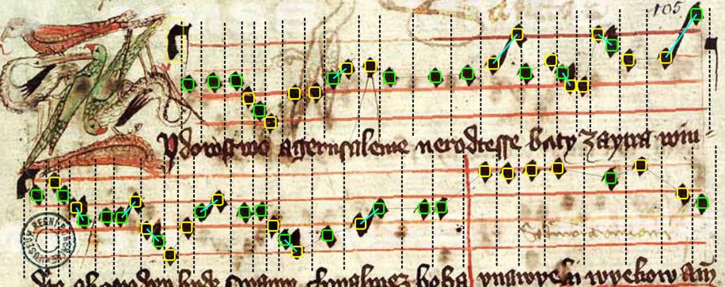
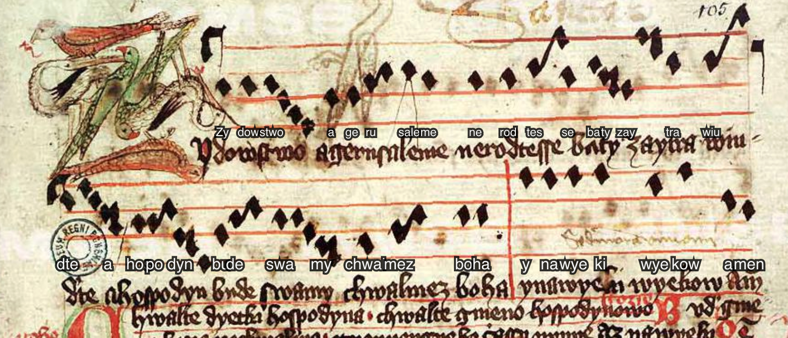

# Getting Started

Welcome to **OMMR4all**! This guide will walk you through what the tool does, how to access it, and how to get started with using it — step by step.

---

## What is OMMR4all?

**OMMR4all** is a web-based tool for Optical Medieval Music Recognition. It helps you transcribe and annotate medieval music manuscripts, offering:

- Automatic detection of musical elements
- Manual correction and annotation
- Visual organization of scanned sources

---

## Key Goals and Use Cases

OMMR4all is designed to:

- Support musicologists in the digitization of medieval chant
- Provide a **semi-automatic pipeline** — with manual corrections possible at every stage

---

## Step 1: Getting Access

### Online Access

You can try out the application via our **[online demo](https://ommr4all.informatik.uni-wuerzburg.de)** — no login required.

To request full access, please email:

📧 **tim.eipert@uni-wuerzburg.de**

### Local Installation

If you prefer running OMMR4all on your own infrastructure, visit the [Local Use](/local-use) section for setup instructions.

---

## Step 2: Explore the Interface

Once you open the [online app](https://ommr4all.informatik.uni-wuerzburg.de), click on **“Books”** to see the available sources.

Select any book to view its scanned pages:

### Interface Overview

- **Left Sidebar**
    - *View content*: Page thumbnails
    - *View documents of book*: List of transcribed chants
    - *Comments*: Community notes and feedback
    - *Workflow methods*: Tools for batch transcription

- **Center Area**
    - Displays all scanned pages
    - Pages with **green backgrounds** are fully transcribed

- **Right Sidebar**
    - Export and upload buttons (login required)

Click on a page to enter the **Transcription View**.

---

## Step 3: Understand the Annotation Layers

OMMR4all uses different annotation layers to visualize your manuscript data. You can toggle their visibility from the **right sidebar**.

### Staff Lines

Displayed as **blue horizontal lines**:

---

### Layout Areas

Shown as **colored polygons**, marking different sections of the page:

---

### Symbol Annotations

These identify and group neume components:

- **Rounded squares**:
    - Green = between lines
    - Yellow = on lines
- **Large yellow rectangle** = clef
- **Light grey lines** = sequential elements
- **Light blue lines** = connected components
- **Dashed vertical lines** = start of new neumes

---

### Text Annotations

To see textual data aligned to syllables, toggle *Show annotations*. The annotations appear over the scanned text and are already assigned.

---

## Step 4: Upload Your Own Scans

Want to work with your own material? Here's how to prepare and upload scans.

### Requirements

Make sure your scans follow these rules:

- Format: `.jpg` or `.png`
- One column per image (split two-column pages beforehand)
- All pages compressed into a `.zip` archive

No other preprocessing is needed.

---

### Upload Instructions

1. **Log in** to your account
2. Go to the [book overview](https://www.ommr4all.informatik.uni-wuerzburg.de/en/book)
3. Click the upload icon:

   

4. Select your `.zip` file
5. Upload and start transcription!

---

You’re now ready to begin transcribing medieval chant with OMMR4all!

Next up: Dive into the detailed annotation workflows.
