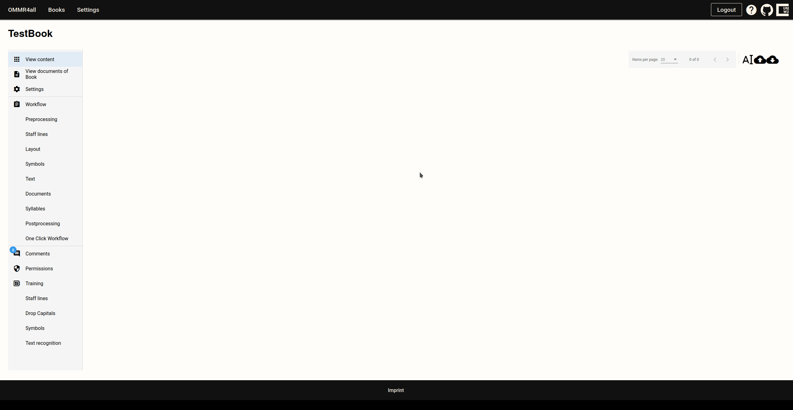
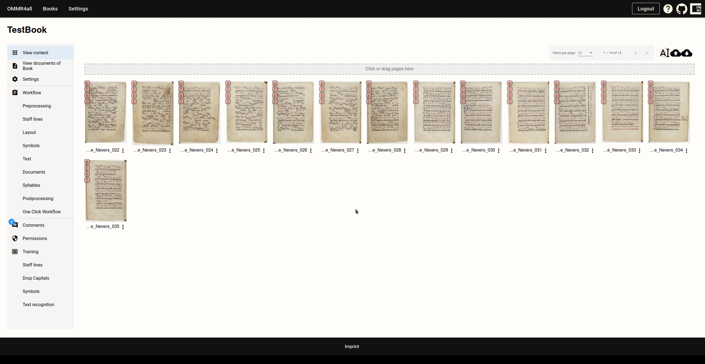

# Importing Images
---
## Importing Images

In order to process the images they have to be imported

To import them in the application, got to the corresponding manuscript dashboard and click on the cloud icon (top-right) .
Just drag and drop images to the **drag area**. Alternatively by clicking on the **dragging** area the system file explorer opens where the images can be selected.

::: note
For each of the image, a thumbnail appears. The red squares on each thumbnail showcase the current transcription/correction stage.
There are four squares total reflecting the steps of our workflow (staff lines, layout, symbols, text+syllables). They automatically turn green, if the stage is marked as finished.
When all steps are marked as completed, the page additionally receives a green background in the overview.
:::

::: info
Make sure your scans follow these rules:

- Format: JPEG, PNG, GIF, TIFF, BMP (and PDF-Images)
- One column per image (split two-column pages beforehand)

:::

## Renaming images
::: note
This step is optional

:::
It often makes sense to rename images. To do this, click on the  icon (top right).
This opens a window where you can set the start folio, page slide (left or right), and prefix. All uploaded pages are renamed uniformly in the order in which they are displayed in the overview.

