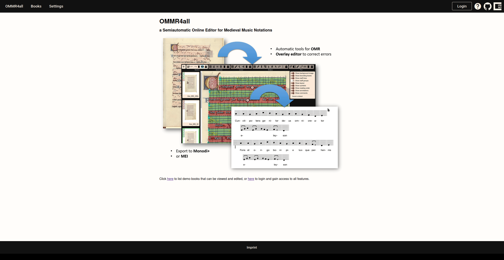

# Logging into OMMR4all

As long as you are not logged in the application, many pages will not be accessible to you. To log in the application, go to your OMMR4all homepage, and click on “Login”, then enter your username and your password. 

::: important
In order to access most of the features and to create a manuscript you need to have an account. 
:::

::: note
You can try out the application via our **[online demo](https://ommr4all.informatik.uni-wuerzburg.de)** — no login required.

To request full access, please email:
- **alexander.hartelt@uni-wuerzburg.de** or
- **tim.eipert@uni-wuerzburg.de**
:::

