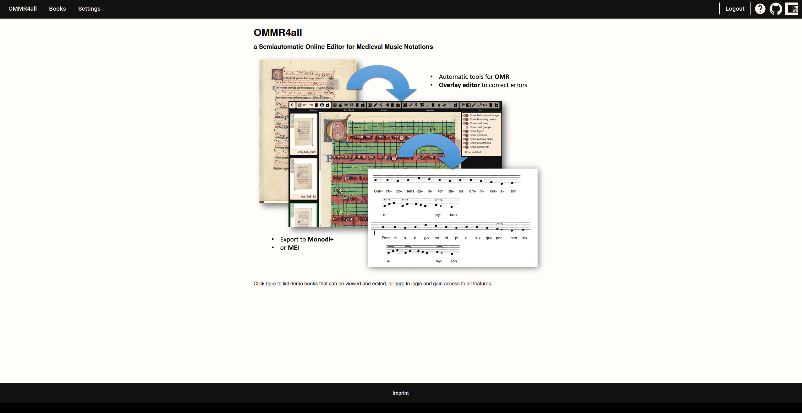
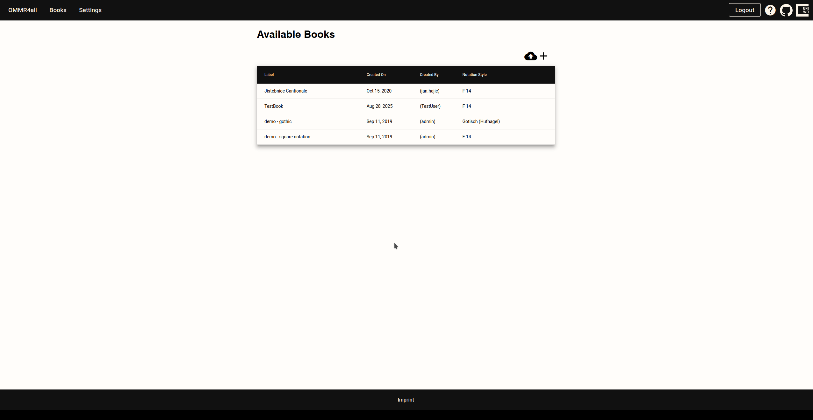

# Creating a new Manuscript

In OMMR4all the data is organized as manuscripts which contain the pages, which in turn contain all transcribed data.

To access most of the features of OMMR4all you need to have access to a manuscript.
A list of available manuscripts can be accessed by clicking on the Books tab. 

In the Book tab you can create a new manuscript by clicking on the **+** icon (Top-right)

Hereby, the user is requested to provide their name, the style, and the number of staff lines per staff. The first two points can be changed retrospectively in the source settings, but the number of staves cannot be changed.
::: note
An administrator can create new styles. For each style, a default model for each step of the pipeline (staff lines, symbols) can be selected. For example, the
default models can differ between **square notation** and **hufnagel** notation.
:::

Click on the created manuscript to access the manuscript dashboard

::: info

Backups of manuscripts can be uploaded as a whole via .
:::

