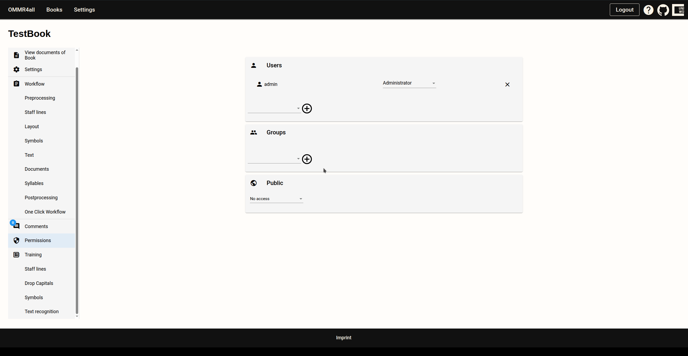

# Permissions

OMMR4all allows multiple users to work on a manuscript. To do this, users can be invited to the manuscript and assigned rights:

OMMR4all allows the following rights to be assigned:
- Read Permission
- Write Permission
- Maintainer Permission
- Administrator Permission

OMMR4all also allows workgroups to be created so that entire groups can be invited to the manuscript.

::: important
Simultaneous editing of the same page by multiple users is not supported. However, users can edit different pages in the same document at the same time.
:::