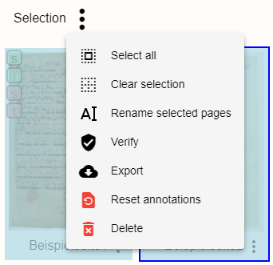
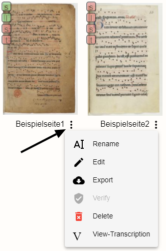
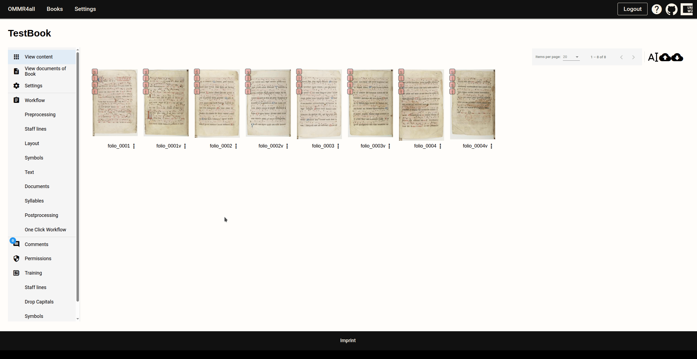
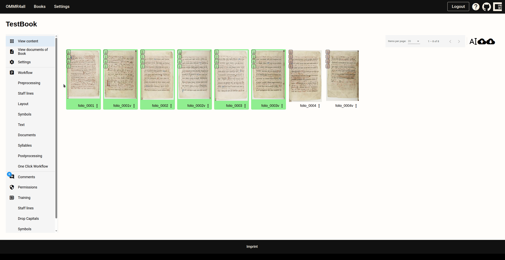

# Export data

## General

With , it is possible to export all pages of the manuscript coherently in various file formats. These can be: the original image files, Monodi Plus files, the transcription with associated image coordinates, a backup of the source, and MEI 4 files.

::: info

Most of the options available for individual pages are also available for selecting all pages via the menu or several specific pages via ``Shift`` + ``Mouse1`` button.

Selection of multiple pages:

Individual pages:

If the page has a green background, the previously grayed-out Verify option is enabled. This allows the page to be set as finally verified after a correction step. The editing functions of the editor are disabled to prevent further changes.

:::

## Chant export

In addition to the source overview with the individual pages, there is an overview of all (chants) with the start and end lines and the drop capital. In OMMR4all, documents are defined as the units of the source that have been marked with the **Documentstart** property in the editor. Documents can span multiple pages and are therefore suitable for division into logical units. The start line is lyric line with the **Documentstart** property and the end line corresponds to the last line before the next **Documentstart**.
The documents can be viewed individually in the viewer or exported.

