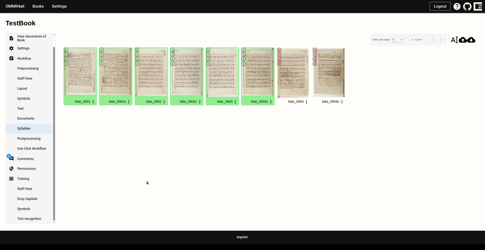

# Training new models

As already mentioned, OMMR4all also offers an iterative training workflow. This means that data that has been corrected/annotated can be used for training.

To do this, you need to switch to the training view. For each step of the pipeline, there is a separate subsection with which models can be trained.

The configuration for training is simple. The following parameters can be set:

- Fine-tuning and selection of a model
- Selection of training materials (only data from the book, or also data from other books)

OMMR4all only uses data that has been marked as corrected. This means that if new symbol recognition models are to be trained, only pages with a green box in the page overview will be used. (For layout, it is sufficient if the L box is green; for symbols, the s box must be green).

