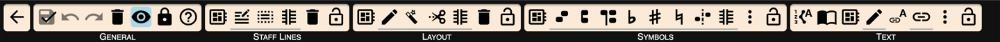
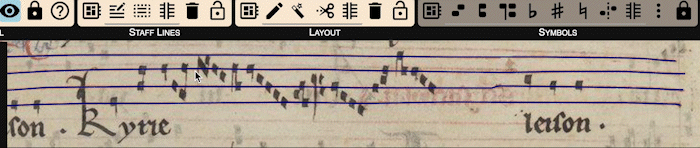
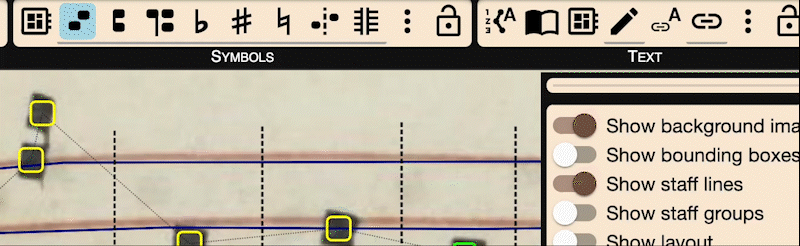

# Workflow Overview

This guide walks you through the full OMMR4all transcription process, from page upload to symbol and text annotation. Each step combines automatic processing with manual editing to ensure high-quality results.

---

## Edit Manuscript Pages

### Basic Orientation
Open a page in transcription view. The selected page should be shown in the center view.
To navigate within the scanned page, you have the following options:
* To pan (switch to different positions) use the middle mouse button or hold `ALT`/`Option` and drag the page 

* To zoom you can use the scroll wheel.

### Transcription Toolbar 
You have to click on the pen symbol in the top bar to access the edit tools.
The top toolbar provides access to the four main annotation steps: **Staff Lines**, **Layout**, **Symbols**, and **Text**. Only one mode can be active at a time.

---

## Staff Line Annotation

### Automatic Detection
Click on the first button in the staff lines part of the top menu.
OMMR4all attempts to detect staff lines based on the configured number of lines per system. Detected lines appear as dark blue paths over the image.

### Manual Line Correction and Annotation

You can correct or add lines by selecting a line and adjusting its control points. New lines are drawn point by point and confirmed with `Enter`. To cancel, press `Esc`, `Backspace`, or `Delete`.

Proper line placement is crucial since all symbol recognition relies on the positioning of staff lines — not the layout zones.
If there are lines that are colliding with other elements, you can use the trim tool to cut the ends of the staff:

### Grouping Single Lines to a Staff

Detected lines are grouped into staves. You can manually group or split them. To group, draw a box over several lines. Each line belongs to exactly one staff.

Grouped staves are shown in different colors. To split a group, select it and mark a region to remove. You can cancel the operation using `Esc`.

## Layout Annotation

### Types of Layout Area

Each zone is assigned one of five types:
- **Notation** (green): contains staves
- **Text** (red): contains lyrics
- **Drop Capital** (purple): initials
- **Folio** (light blue): folio info
- **Paratexts** (orange): decorations or notes

Zones can also be marked as **Reconstructed** (not visible in the scan) or **Document Start** (first zone of a new logical unit).

### Automatic Detection

Two layout models are available:
- **Simple detection** identifies notation and text areas.
- **Complex detection** also finds initials, folios, and more.

Each page is segmented into zones based on pixel classification, which helps ensure accurate downstream processing.

### Manual Layout Correction and Annotation

You can edit zones using three tools:

- **Pen Tool**: Draw zones and adjust shape by modifying boundary points.
- **Magic Wand**: Extend a zone by connecting it to adjacent pixels (based on image structure).
- **Scissors Tool**: Freehand extension of an active zone, starting and ending inside the zone.

Zones of the same type can be merged if they overlap. Select them and press `J` or use the context menu.

---

## Symbol Annotation

### Automatic Detection

OMMR4all can automatically detect symbols used in medieval square notation:
- Neume elements (Normal, Oriscus, Apostropha, Liquescence up/down)
- Clefs (C, F)
- Accidentals (flat, natural, sharp)

Symbols are assigned a position relative to the staff and are color-coded:
- **Green** = between lines
- **Yellow** = on a line
- **Red** = low confidence (not exported)
- **Pink segments** = melodic outliers (to review)

### Manual Symbol Correction and Annotation

You can insert a symbol by selecting a type and clicking on the image. Moving symbols updates their color automatically.

To prevent automatic logical linking when placing a new symbol, hold `Shift`. Otherwise, notes are grouped into neumes automatically. You can also:
- Move symbols via drag and drop
- Delete symbols with `Delete` or `Backspace`
- Change symbol type via shortcuts or the dropdown in the right panel

### Logical and Graphical Connections

Symbols are connected in two ways:

- **Logical connections** (dashed lines) define neume groupings. You can toggle the `Start of neume` property or remove connections with the separation tool.
- **Graphical connections** (solid lines) indicate visual closeness and can be toggled with the `Connected` checkbox.

- **Fixed order** locks the symbol's reading order, independent of its x-position.

An "Auto insert neume starts" tool assigns `Start of neume` to all unlinked symbols.

---

## Text Detection

### Text Import

You can add text manually or import it from an external source. Imported text must be syllabified using spaces or hyphens. Special characters can be inserted from a preset list.

Text is associated with red or purple zones and appears in the reading order panel.

#### Automatic Detection of Text

An OCR model can extract text from lyric and initial zones. Detected text appears in the panel and can be edited zone by zone.

#### Manual Insertion

Users may edit or enter text directly within zones. The system allows adding new characters or syllables to the source-wide list for reuse.

---

## Manipulating Text

## Assigning Syllables to Neumes

This step allows syllables from the text pool to be linked to specific neumes in the music layer.

Manual assignment gives the most control. You select a syllable, then click on the corresponding neume, staying within the boundaries of a text zone and neume group. The editor advances automatically through the list of syllables.

Automatic assignment works in two ways:
- By detecting the closest neume to each syllable
  
  
  

- By assigning one syllable to each neume group, in sequence
 

Both methods can be refined manually afterward.

---

## Importing

Imported text can be inserted from files or copy-pasted into the editor. Make sure syllables are separated by hyphens or spaces. After import, the syllables are available for assignment to neumes. You can also use the same pool across multiple pages.

---

This concludes the full walkthrough of the OMMR4all workflow. Each annotation step builds on the previous one, enabling a structured and flexible approach to the digital transcription of medieval chant manuscripts.
