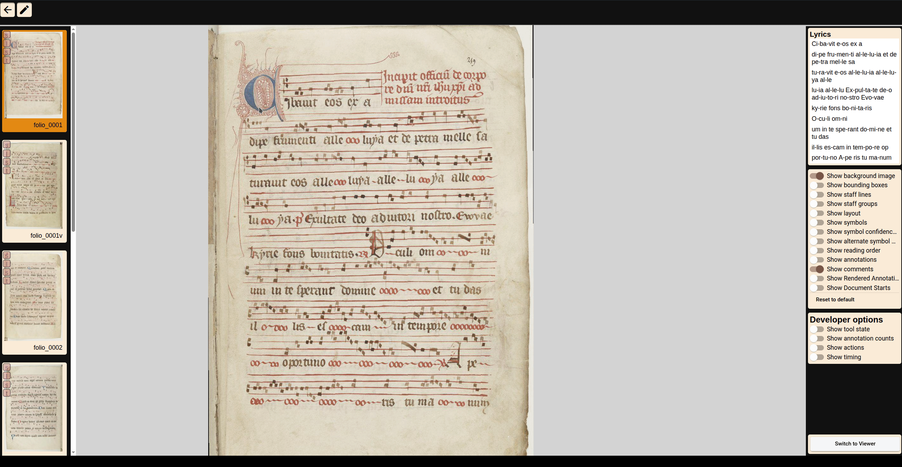

#### Basic Orientation
Open a page in transcription view. The selected page should be shown in the center view.
To navigate within the scanned page, you have the following options:
* To pan (switch to different positions) use the middle mouse button or hold `ALT`/`Option` and drag the page 

* To zoom you can use the scroll wheel.

#### Shortcuts

OMMR4all offers a number of shortcuts that are helpful and can significantly speed up transcription/correction. The shortcuts can be viewed directly in the tool.
::: info
Depending on the selected tools, different shortcuts are displayed. The shortcuts can be displayed using `?`.
:::

#### Transcription Toolbar 
You have to click on the pen symbol in the top bar to access the edit tools.
The top toolbar provides access to the four main annotation steps: **Staff Lines**, **Layout**, **Symbols**, and **Text**. Only one mode can be active at a time.

::: note
In the text section, tools are provided to correct or transcribe syllable assignments
:::

#### Overlay

On the right side of the editor you have the option to customize the overlay of the annotations.

::: tip
You can toggle as many panels as you want at once. It is not advised to have all of them active at the same time, though, because it limits the readability of the documents. 
Also, for each pipeline step exists a custom overlay config. So for example if you switch to the symbol step, only symbol related annotations are shown by default. Other annotations like the layout is not shown by default, as it can interfere the correction/annotation workflow.
:::
#### General Section

Here you will find general functions that affect the entire page. In addition to the familiar Save, Undo, and Redo functions, you can delete all editing elements at once, activate read mode, complete all four editing steps at once, and display the shortcuts.
In read mode, the editing elements are displayed without the option to change them. It is automatically disabled as soon as an editing function is activated and must then be reactivated manually.
The shortcuts are adapted to the respective editing function. Only the general shortcuts for moving and zooming the image and for saving the page remain the same in every editing step.

#### Automatic Transcription

In the editor, automatic transcription can also be performed for each pipeline step on the page level. Of course, this is only necessary if it has not already been done for the entire book.