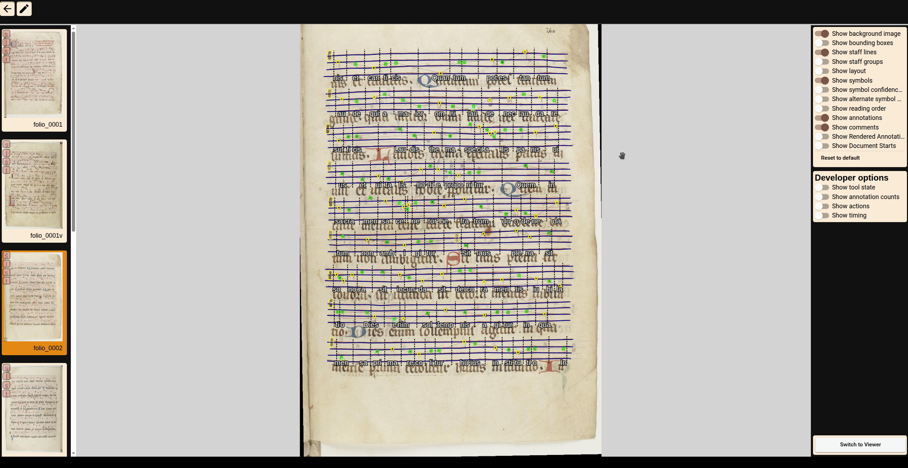
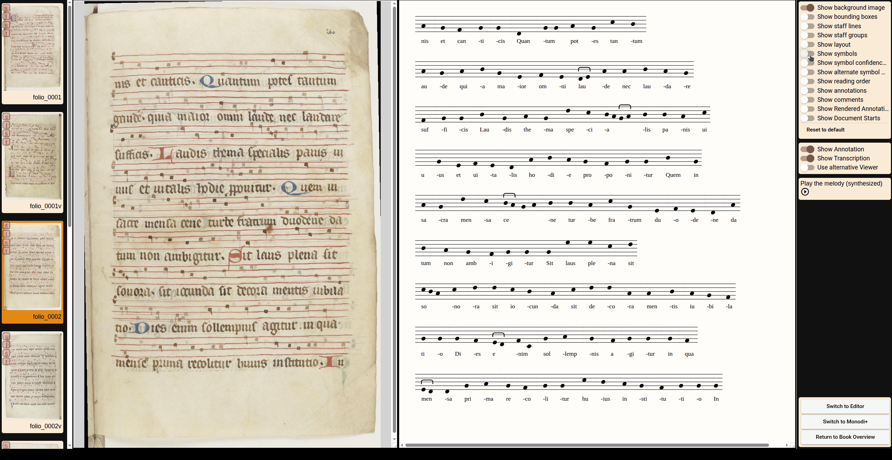
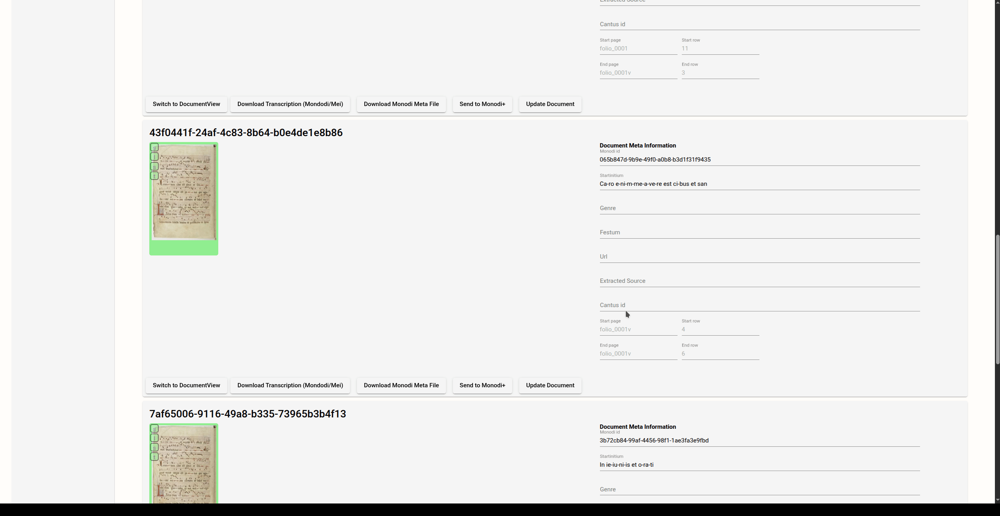

# Visualize Results
The transcription can also be visualized:

- Directly inside the editor:

- Using the **Corpus Monodicum** renderer:
Also the same internal renderer as used in **Corpus Mondodicum** viewer can be accessed directly from the editor from the editor via **Switch to Viewer** button. The transcription view will only render the output if the characters and text with syllable assignment are available.
The viewer can also split the view. Then the original image file and the transcription view will be displayed. 

The display options for the image are still fully available to show or hide various editing elements in the overlay. On the transcription view page, there is the option to play back the melody synthetically.

::: info
The visualization is page based. From the documents/chant view a chant based visualization can be displayed.

:::

## Chant based Visualization

