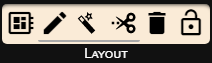
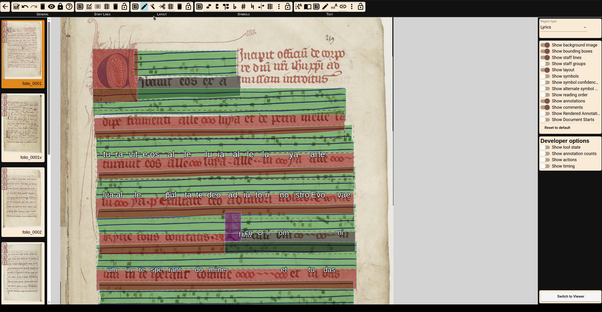
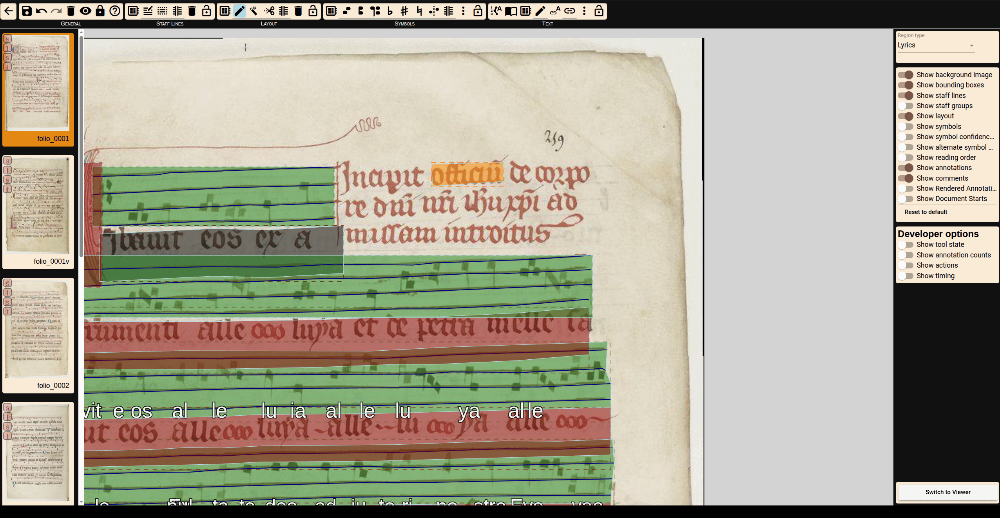
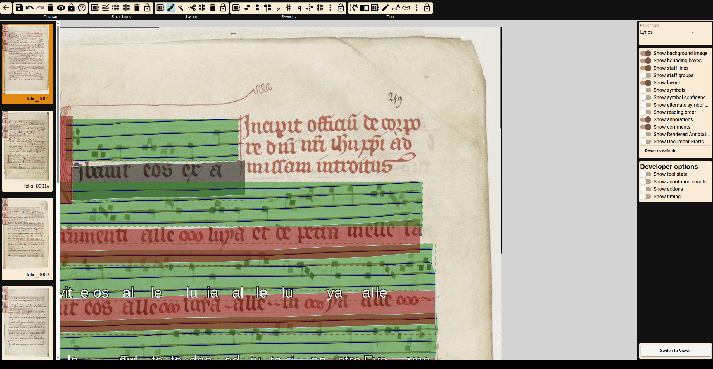
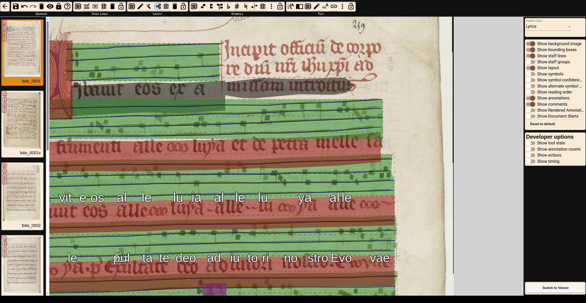

# Layout Annotation

### Types of Layout Area

Each zone is assigned one of five types:
- **Notation** (green): contains staves
- **Text** (red): contains lyrics
- **Drop Capital** (purple): initials
- **Folio** (light blue): folio info
- **Paratexts** (orange): decorations or notes

Zones can also be marked as **Reconstructed** (not visible in the scan) or **Document Start** (first zone of a new logical unit (chant)).

### Automatic Detection

Two layout models are available:
- **Simple detection** identifies notation, text areas and initials and chant instances.
- **Complex detection** also finds initials, folios, and more (Old).

Each page is segmented into zones based on staff lines and segmentation output, which helps ensure accurate downstream processing.

### Manual Layout Correction and Annotation

You can edit zones using four tools:

- **Pen Tool**: Draw zones and adjust shape by modifying boundary points.

- **Magic Wand**: Extend a zone by connecting it to adjacent pixels (based on image structure).

- **Scissors Tool**: Freehand extension of an active zone, starting and ending inside the zone.

- **Split Tool**: Split lyric lines into two lines. Helpful if you want to correct missing chant instances

Zones of the same type can be merged if they overlap. Select them and press `J` or use the context menu.

---
