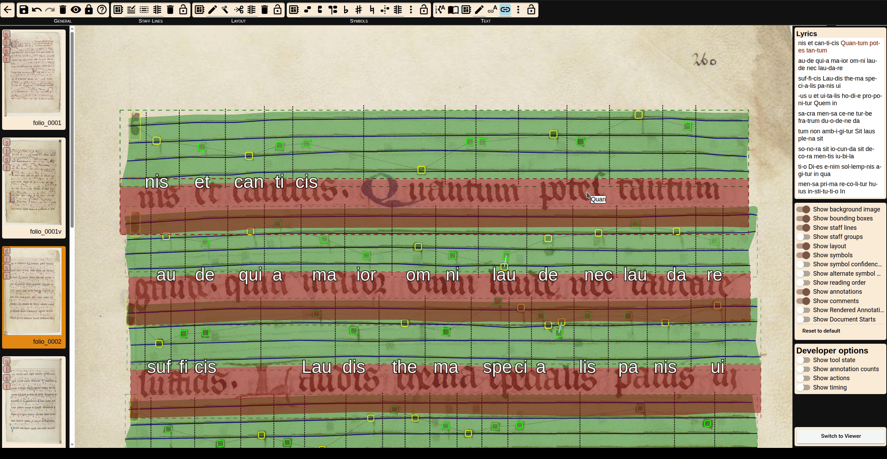
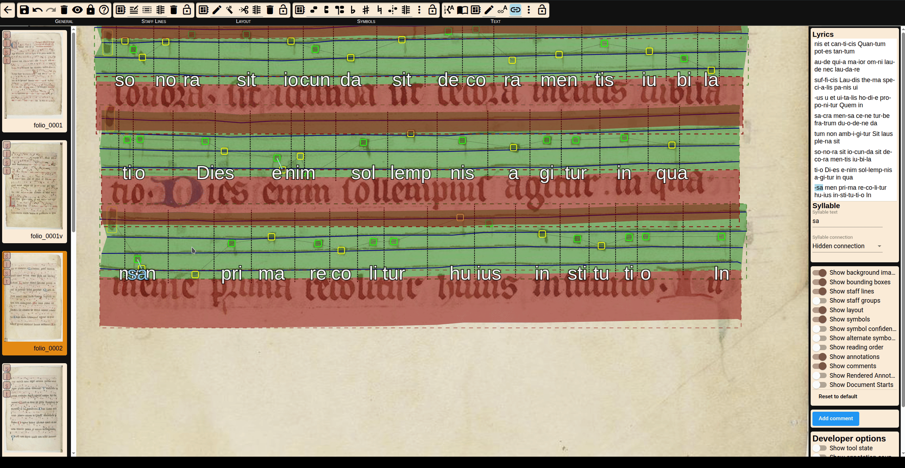

# Assigning Syllables to Neumes

This step allows syllables from the text pool to be linked to specific neumes in the music layer.

## Automatic Assignment
Automatic assignment works in two ways:
- By detecting the closest neume to each syllable
  
  
  

- By assigning one syllable to each neume group, in sequence
 

Both methods can be refined manually afterward.

## Manual Correction

The syllables are listed on the right side of the editor. Syllables not assigned to a neume yet are marked in red. If you click on a syllable and afterwards on a neume it will assigne it to that neume. The editor advances automatically through the list of syllables.
  

Existing syllables can also be easily corrected using drag and drop. To do this, simply click and hold a syllable and move it to the correct number group, staying within the boundaries of a text zone and neume group.
  

