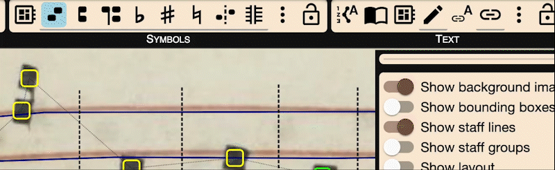

# Symbol Annotation

### Automatic Detection

OMMR4all can automatically detect symbols used in medieval square notation:
- Neume elements (Normal, Oriscus, Apostropha, Liquescence up/down)
- Clefs (C, F)
- Accidentals (flat, natural, sharp)

Symbols are assigned a position relative to the staff and are color-coded:
- **Green** = between lines
- **Yellow** = on a line
- **Red** = low confidence (not exported)
- **Pink segments** = melodic outliers (to review)

### Manual Symbol Correction and Annotation

You can insert a symbol by selecting a type and clicking on the image. Moving symbols updates their color automatically.

To prevent automatic logical linking when placing a new symbol, hold `Shift`. Otherwise, notes are grouped into neumes automatically. You can also:
- Move symbols via drag and drop
- Delete symbols with `Delete` or `Backspace`
- Change symbol type via shortcuts or the dropdown in the right panel

### Logical and Graphical Connections

Symbols are connected in two ways:

- **Logical connections** (dashed lines) define neume groupings. You can toggle the `Start of neume` property or remove connections with the separation tool.
- **Graphical connections** (solid lines) indicate visual closeness and can be toggled with the `Connected` checkbox.

- **Fixed order** locks the symbol's reading order, independent of its x-position.

An "Auto insert neume starts" tool assigns `Start of neume` to all unlinked symbols.

### Advanced Symbol Types

OMMR4all can detect and annotate advanced symbol types

---
