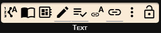
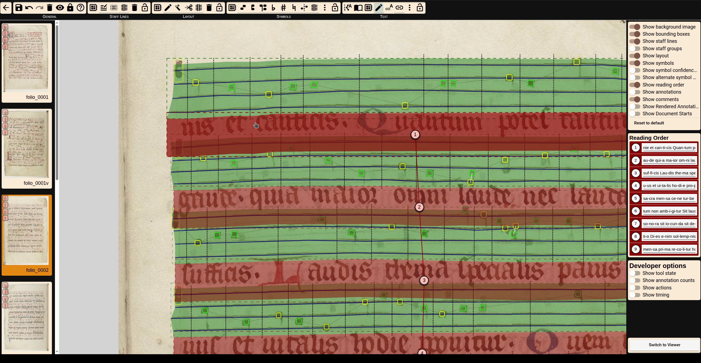

# Text Detection

The editing step for the text on the page consists of three parts: determining the reading order, transcription of the text, and assigning syllables.
## Reading order
The reading order can be set automatically via 
 or the context menu, or manually via drag and drop in the display in the right-hand column. The list only contains the text of lyrics and drop capital zones, because the other zone types are treated as independent elements.

## Transcription of the text
There are several methods (automatic and manual) for transcribing text.

### Text Import
If the text is stored in an external file, it can be inserted using . Imported text must be syllabified using spaces or hyphens. In terms of formatting, the tool requires hyphenation (-) or spaces, because contiguous character strings are processed as one syllable. Line breaks are retained. When inserting text from external sources, it is possible to assign syllables immediately afterwards, in which case you will be redirected to the selected function.
Special characters can be inserted from a preset list.

### Automatic Detection of Text

An OCR model can extract text from lyric and initial zones. Detected text appears in the panel and can be edited zone by zone.

### Manual Insertion

Users may edit or enter text directly within zones. The system allows adding new characters or syllables to the source-wide list for reuse.

### Dictionary

OMMR4all marks word not known to the system as red. By right-clicking on the word a list of suggestions appear.

::: info
You can also add the word to the dictionary. The next time the word appears it will not be marked anymore.

:::

---
