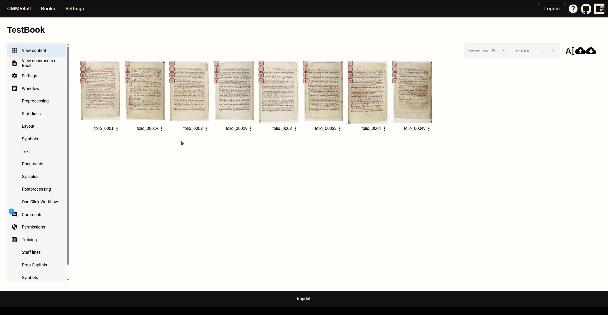
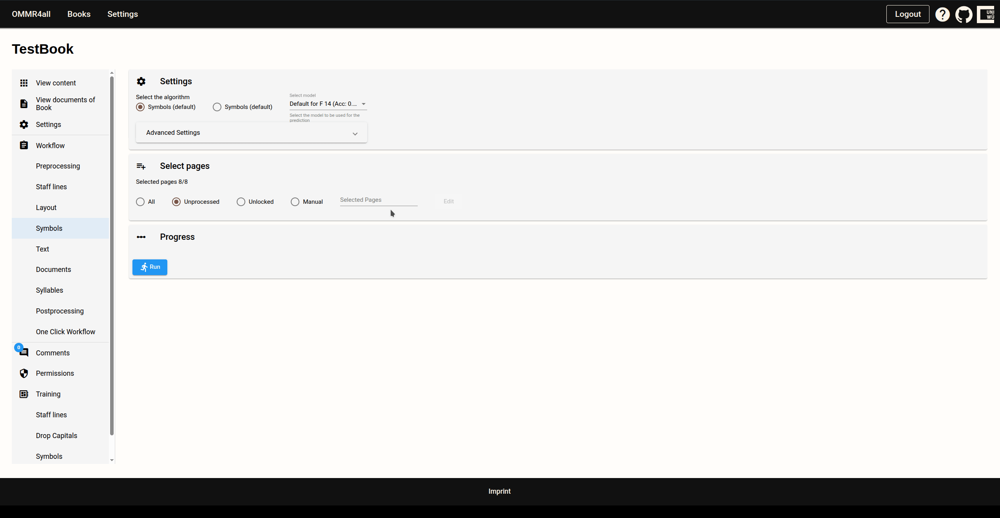

# Workflow overview

OMMR4all offers two primary workflows for music transcription:

- With Suitable Models available: Utilizes automatic transcription of the entire document, followed by proofreading to
correct any errors
-  Without Suitable Models available: Implements an iterative training process where pages are initially manually corrected
or marked. This corrected data is then used to train models, which can be looped through repeatedly until effective
models are achieved.

## With Suitable Models available:

This is the simplest case. Suitable models already exist because manuscripts with similar styles have already been
transcribed and trained on these models.

The workflow consists of eight steps:

1. **Preprocessing**: Data preparation, such as normalizing the pages.
2. **Staff Lines**: Recognition of staff lines and staves.
3. **Layout Detection**: Recognition of text regions and music parts. Additionally, song instances are identified.
4. **Symbols**: Recognition of symbols.
5. **Text**: Recognition of text and syllables.
6. **Documents (Optional)**: Alignment of song texts to recognized text for improving OCR.
7. **Syllables**: Assignment of syllables to notes.
8. **Post-processing (Optional)**: Removal of line groupings.

The automatic transcription can be started via the workflow section located on the left. Each step has to be executed in sequence.

Often there are settings that can be configured, such as model selection or the selection of pages which should be transcribed.

After executing the recognition for all mandatory steps, the result can be viewed.

## Without Suitable Models available:

If no suitable models may exist, or the results from the available models is too poor, it is
possible to manually correct/annotate pages and use these annotations to train improved models.

For evaluating the results, one can access the editor.

